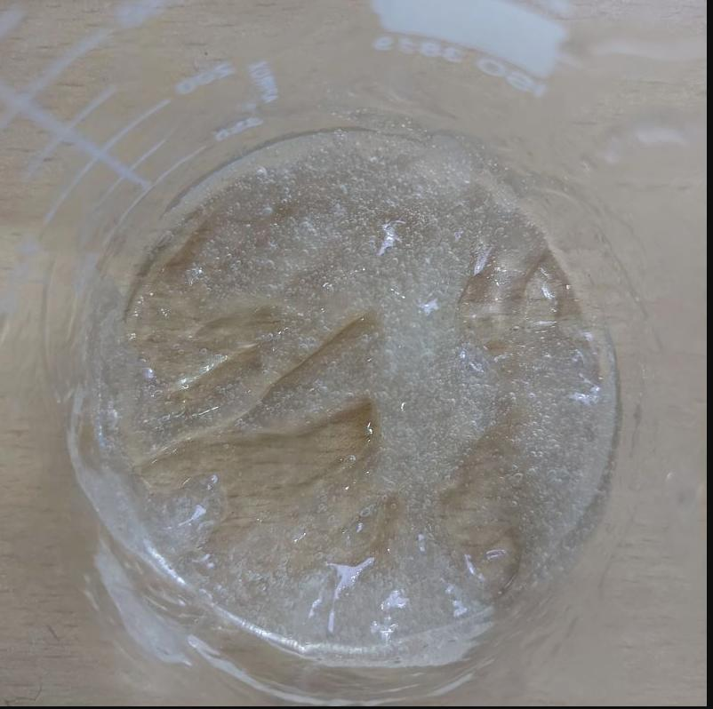
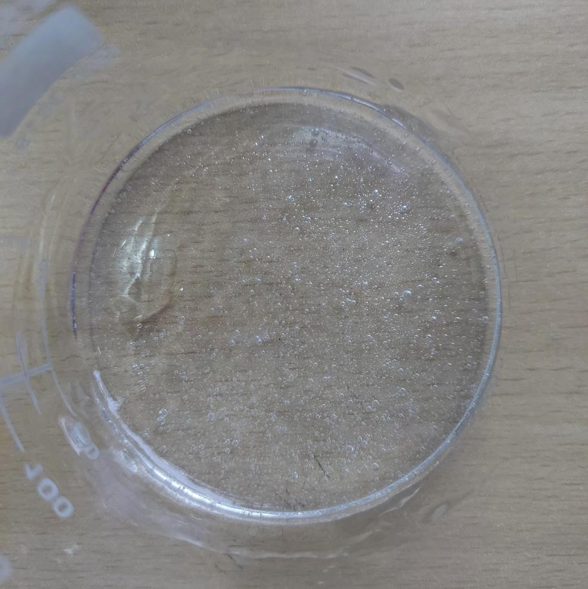

Today, I decided to experiment with Xanthan Gum by making a gel with it. So, in the first attempt, I added all the Xanthan Gum into a mixture of glycerin and water at once. Well, it turned into a clumpy party! The gel ended up uneven, and I had to spend a good chunk of my time trying to break up those clumps and even out the texture.😮‍💨

Round two: Took it slow, added the Xanthan Gum bit by bit into the glycerin, stirred it, let it sit for a while, and then introduced it to the water.

Voila! 🪄 The gel was so much smoother and evenly thick. Also, the mixing part was such a breeze compared to round one.

Note to self and fellow gel enthusiasts: Gradually incorporating Xanthan Gum into glycerin before water can lead to a smoother and more evenly textured gel. It can also make the mixing process so much easier!