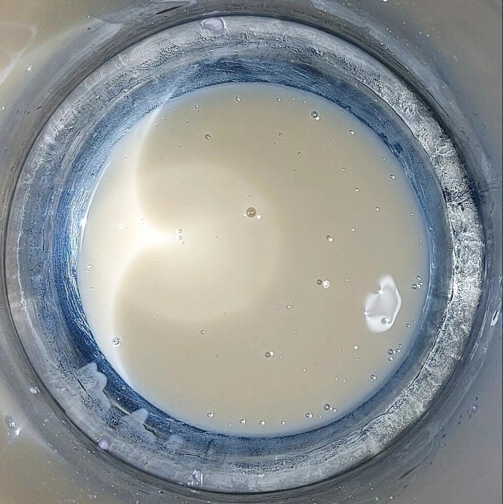
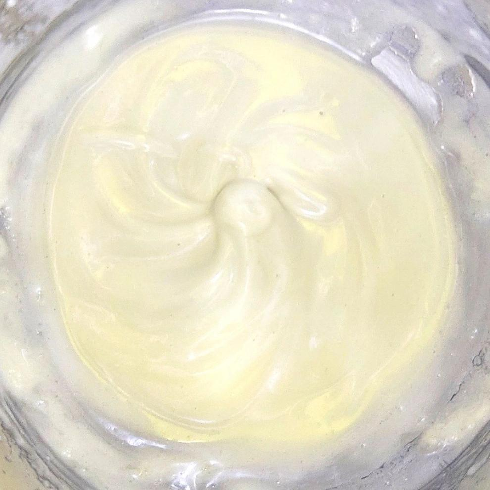

Anhydrous body butter has been a tempting DIY project for me, and I've dived into the challenge since the day I started my home lab. Yet, my attempts have been a train of failures, and the main reason is the scorching environment I call home.

I have tried many cooling techniques - "freezer olympics" - where I race from my lab to the freezer after every 2 minutes of whipping and many others. Despite my best efforts, the body butters always collapse after a few minutes at room temperature - just like my dreams of a beautiful, whipped body butter.🥲

Hot processing hasn't worked for me yet, as shown in the first image. The second one was cold processed with 79% (the majority of which is cocoa butter) of butters, which, even though a bit soft, was still better than the first one.

I also added some kaolin clay to offset the greasiness.

My next move is to try hot processing again, this time with a higher butter percentage, and incorporating beeswax and thickeners for added stability.

If you've conquered the art of body butter in hot and humid climates, drop your tips in the comments below.

Ingredients from:
Purenso Global and The Art Connect