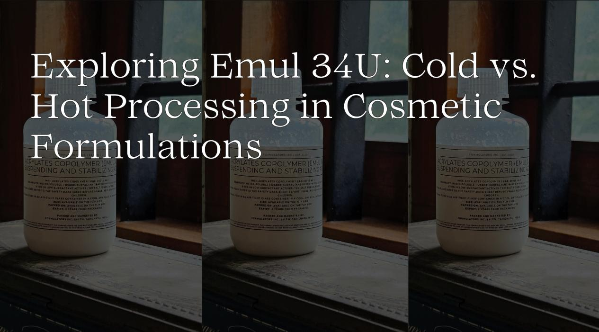

Choosing a suitable emulsifier is crucial for creating stable and effective cosmetic products. Recently, I decided to experiment with Emul 34U from Art Connect, a cold-processable emulsifier. The selection of ingredients that can be found online and in small quantities is limited. Even though I haven't heard much about it in the formulation community, I got it with the hope that I would experiment and find out.

## Ingredient Research

According to [cosmetics.specialchem.com](http://cosmetics.specialchem.com/), “EMUL 34(U) acts as a suspending, thickener and stabilising agent. It is an excellent alkali-swelled anionic polyacrylic rheology modifier. It provides slight salt tolerance and good compatibility with anionic and non-ionic surfactants. EMUL 34(U) is used in foundation, sunscreen, shampoo, shower gel and cosmetic products.”

## Cold Processing Experiment

In my opinion, the best way to understand an emulsifier is to use it to emulsify just oil and water without any other ingredients. I used apricot kernel oil and an ester, isopropyl myristate from Purenso in the oil phase, distilled water from Art Connect, and glycerin in the water phase.

## Ingredients:

* Water Phase: 9% Emul 34U, 10% glycerin and distilled water.
* Oil Phase: 9% apricot kernel oil, 8% isopropyl myristate from Purenso.

## Method:

I mixed Emul 34U with water and then combined it with the oil phase.

I cold-processed it, mainly because I have been travelling away from my formulation lab. I am a little rusty and feel lazy, so I wanted to do a warm-up formulation before any heating or waiting. Cold processing means not using any heat.

Once I was done, it was still not as thick as it should be. Based on my research on this ingredient, I knew that to thicken the emulsion, I should neutralise it. I used some triethanolamine to neutralise it.

The lotion thickened up slightly, creating a fun texture I couldn't resist playing with.

_Cold Processed Emulsion_

## Hot Processing Experiment

For the next experiment, I wanted to hot process it. I also wanted to include a wax to mix waxy and polymeric thickening.

## Ingredients:
* Water Phase: 9% Emul 34U, 10% glycerin and distilled water.
* Oil Phase: 9% apricot kernel oil, 8% isopropyl myristate, and 5% cetearyl alcohol, all from Purenso.

## Method
After heating them to the same temperature and melting the cetearyl alcohol in the oil phase, I emulsified the 2 phases. Then, I neutralised them with some base.

This one gave me a thicker texture, understandably.

_Hot Processed Emulsion with Cetearyl Alcohol_

## Results
Both lotions were light and fast-absorbing.  They had a slight polymer film that dissipated quickly. The one with cetearyl alcohol soaped up a bit on application.

I have a better idea of how to work with Emul 34 in the future. Also, the datasheet says, “The minimum recommended use level of EMUL 34U polymer in surfactant-based products is 5.0% as supplied. The polymer use level depends on the amount of surfactant and assumes the use of salt for additional thickening.” Maybe I will try out a surfactant formulation.

As I wrap up this phase of experimentation, I'm already looking forward to the next. I'm looking to test the emulsifying capabilities of Emul 34U with different sizes of oil phases. Stay tuned for more exciting discoveries!

Originally Published at - [Linkedin](https://www.linkedin.com/pulse/exploring-emul-34u-cold-vs-hot-processing-cosmetic-nawal-abdul-kareem-8qvac/?trackingId=cIxBBFryQ5%2BcavWik11V1w%3D%3D)

