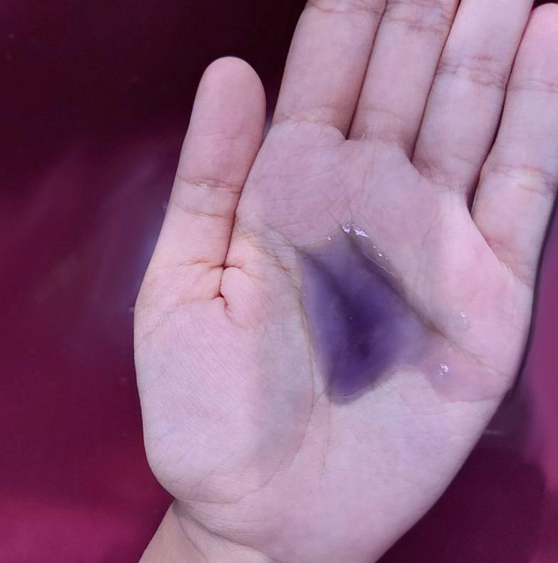

I made my first hand wash today. This is first time I am working with surfactants.

I was concerned it wouldn't turn out well because I added a bit more guar gum than I had initially planned. The guar gum had just arrived today, and I had seen so many videos on formulating with guar. So, my excitement got the better of me😅.

This was one of the few formulations where I went in without a lot of planning. I used a combination of anionic and amphoteric surfactants. I am quite happy with the foam—it turned out much better than expected.

The only prior planning I did was that I calculated the active surfactant matter (ASM) of the final formulation. Everything else was more or less a guess. I also wanted to include a small quantity of a carrier oil (to make it milder) and a fragrance oil. I wasn't sure how to go about this, so I used a solublizer. I added the pre-mixed oils and solubilizer phase as the final step. I'm not sure if it was the right choice, but so far, so good. If you have any suggestions on how to improve this process, please let me know.

All my ingredients were purchased from Purenso Global and Art Connect
